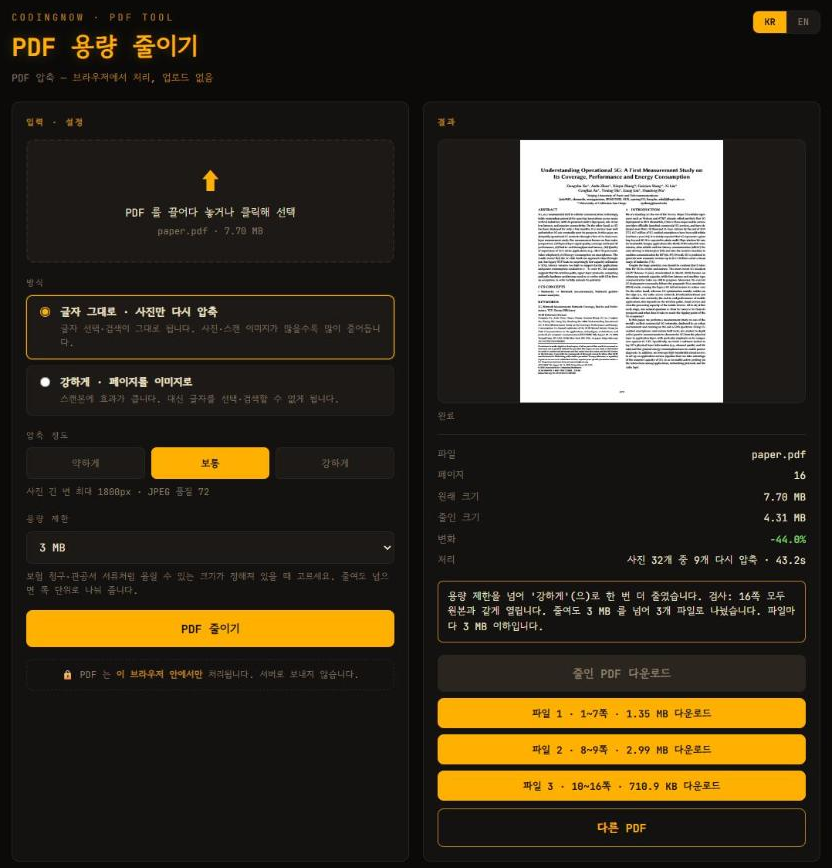

# PDF 용량 줄이기 (PDF Compressor)

> 🌐 **Live (한국어): [www.coding-now.com/pdf-compressor](https://www.coding-now.com/pdf-compressor)** · **(English): [www.coding-now.com/en/pdf-compressor](https://www.coding-now.com/en/pdf-compressor)**

PDF 용량을 **브라우저 안에서** 줄이는 단일 HTML 도구입니다.
보험사에 진료비 영수증을 내거나 관공서에 증빙서류를 올릴 때 **"8MB 이하"** 같은 용량 제한에 걸리는 경우를 위해 만들었습니다.

> 🔒 PDF 는 **이 브라우저 안에서만** 처리됩니다. 서버로 올라가지 않습니다.



📖 **사용법 글:** [`docs/usage-guide.md`](docs/usage-guide.md) — 블로그·홈페이지 게시용으로 정리한 글.
📚 **방법 비교 가이드:** [PDF 용량 줄이기 무료 방법 — 업로드 없이 압축, 8MB 제한 맞추기](https://www.coding-now.com/guides/reduce-pdf-file-size)

## 기능

- PDF 1개 입력 — 드래그&드롭 또는 클릭해 선택
- 방식 두 가지
  - **글자 그대로 · 사진만 다시 압축** — 글자 선택·검색이 그대로 됩니다. PDF 안의 사진·스캔 이미지만 낮은 해상도의 JPEG 로 다시 저장
  - **강하게 · 페이지를 이미지로** — 쪽마다 이미지 한 장으로. 스캔본에 효과가 크고, 글자 선택·검색은 안 됨
- 압축 정도: 약하게(사진 긴 변 2400px·품질 85) · 보통(1800px·72) · 강하게(1200px·55)
- **용량 제한**(10·8·5·3·2·1MB, 직접 입력)
  - 고른 정도로 줄여도 넘으면 한 단계 더 강하게 다시 줄임(화면에 알림)
  - 그래도 넘으면 **쪽 단위로 나눠** 파일마다 제한 이하가 되게 저장
  - 제한은 1MB = 1,000,000바이트로 계산 — 1MB 를 1,048,576바이트로 보는 사이트에서도 통과
- **결과 검사** — 줄인 PDF 와 나눈 파일을 다시 열어 쪽수를 원본과 비교하고, 모든 쪽을 작게 그려 원본과 비교. 크게 다른 쪽이 있으면 결과를 버리고 원본 유지
- 원래 크기·줄인 크기·변화(%)·처리 내용 표시, 첫 쪽 미리보기
- 한국어 / English 전환

## 실측 (기본 방식 · 보통, 2026-10-06, 크롬)

| PDF | 원래 | 줄인 뒤 | 변화 |
|---|---|---|---|
| 휴대폰 사진 4장을 묶은 PDF | 2.18 MB | 0.18 MB | −92% |
| 스캔본 4쪽 (300dpi) | 5.12 MB | 0.93 MB | −82% |
| 그림이 많은 논문 16쪽 | 7.70 MB | 4.58 MB | −40% |
| 글자 위주 공문서 68쪽 | 0.51 MB | 0.51 MB | −0.3% |

논문에 3MB 제한을 걸면 '강하게'로 다시 줄인 뒤(4.31MB) 1~7쪽 1.35MB · 8~9쪽 2.99MB · 10~16쪽 0.71MB 세 파일로 나눕니다.
결과는 pdf.js 로 쪽마다 원본과 비교했고, 크롬 내장 PDF 뷰어(PDFium)에서도 정상으로 열렸습니다.

## 사용법

pdf.js 가 모듈·작업 스레드(worker)를 쓰기 때문에 `file://` 로 직접 열면 동작하지 않습니다. **로컬 웹 서버로 여세요.**

```
git clone https://github.com/cflab2017/Tool_web_pdf-compressor.git
cd Tool_web_pdf-compressor
python -m http.server 8000
# 브라우저에서 http://localhost:8000/ 열기
```

1. PDF 를 드롭존에 끌어다 놓거나 클릭해 선택
2. 방식·압축 정도를 고르고, 올릴 곳에 제한이 있으면 **용량 제한** 선택
3. **PDF 줄이기** → 검사가 끝나면 **다운로드** (나눈 경우 파일별 단추)

## 동작 방식

- **읽기·쓰기**: [pdf-lib](https://github.com/Hopding/pdf-lib) 로 PDF 안의 이미지 객체(`/Subtype /Image`)를 찾아 다시 저장
  - 지원: `DCTDecode`(JPEG) · `FlateDecode` 8/16비트, 예측자 없음·TIFF(2)·PNG(10~15), 색 공간 RGB·Gray·ICCBased(N=1·3)
  - 건너뜀: CMYK·Indexed·JPX·JBIG2·CCITT·`/Decode`·`/Mask`, 16KB 미만의 작은 그림
  - Flate 그림은 **한 줄씩 풀면서 바로 줄여**(상자 평균) 9177×5776 16비트 그림도 원본 전체를 메모리에 올리지 않음
  - 투명 마스크(`/SMask`)로 쓰이는 그림은 컬러 JPEG 로 바꾸지 않고, 본 그림과 **같은 크기로 함께 줄여** Flate 회색으로 저장
  - 다시 저장한 쪽이 원래보다 10% 이상 작을 때만 바꿈
- **렌더링·검사**: [pdf.js](https://github.com/mozilla/pdf.js) — 미리보기, '페이지를 이미지로' 방식, 결과 검사
  - `intent: "print"` 로 그려 탭이 뒤에 있어도 멈추지 않음(display 는 requestAnimationFrame 을 써서 숨은 탭에서 멈춤)
  - pdf-lib 는 `objectsPerTick: Infinity` — 숨은 탭에서 타이머가 1초로 늦춰져 읽기·저장이 느려지는 것을 막음
- **나누기**: 앞쪽부터 늘려 보다 넘으면 이분 탐색으로 제한 안에 드는 가장 긴 쪽 구간을 찾아 `copyPages` 로 저장

## 기술 스택

- 순수 HTML / CSS / JavaScript (단일 파일 `index.html`)
- 동봉 라이브러리(`vendor/`): pdf-lib 1.17.1 (MIT), pdf.js 4.10.38 legacy 빌드 (Apache-2.0) — 각 라이선스 파일 포함
- 다크 "앰버 CRT 터미널" 테마 (CODINGNOW 도구 공통)

## 라이선스 / 후원

동봉 라이브러리는 각자의 라이선스를 따릅니다: [`vendor/LICENSE-pdf-lib.md`](vendor/LICENSE-pdf-lib.md) (MIT), [`vendor/LICENSE-pdfjs.txt`](vendor/LICENSE-pdfjs.txt) (Apache-2.0).
AGPL 라이선스인 Ghostscript·MuPDF 는 쓰지 않았습니다.

☕ 후원: 도구가 마음에 들면 [CODINGNOW](https://www.coding-now.com) 에서 후원으로 응원해 주세요.
