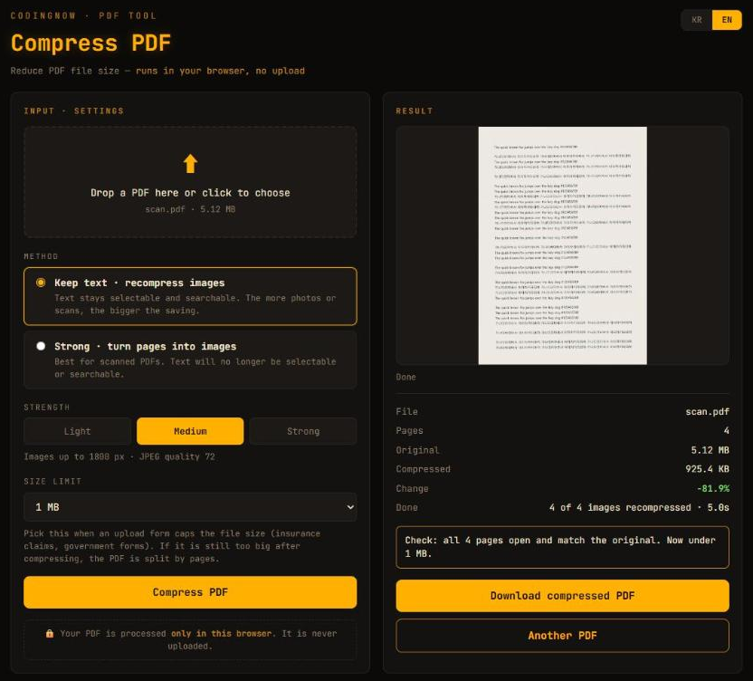

# PDF Compressor — English version

> 한국어: [`../ko/`](../ko/README.md)
>
> 🌐 **Live: [www.coding-now.com/en/pdf-compressor](https://www.coding-now.com/en/pdf-compressor)**

A single-HTML tool that reduces PDF file size **inside your browser**.
It was built for the moment an insurance claim, a government form or an HR portal says **"maximum file size 8 MB"** and your PDF is bigger.

> 🔒 The PDF is processed **only in this browser**. It is never sent to a server or anywhere else.



📖 **How-to:** [`usage-guide.md`](usage-guide.md)
📚 **Guide comparing methods:** [How to Reduce PDF File Size for Free — Compress Without Uploading and Fit an 8 MB Limit](https://www.coding-now.com/en/guides/reduce-pdf-file-size)

## Features

- One PDF in — drag & drop or click to choose
- Two methods
  - **Keep text · recompress images** — text stays selectable and searchable; only the photos and scanned images inside the PDF are saved again as lower-resolution JPEG
  - **Strong · turn pages into images** — every page becomes one image. Best for scans; text is no longer selectable
- Strength: Light (images up to 2400 px, quality 85) · Medium (1800 px, 72) · Strong (1200 px, 55)
- **Size limit** (10 · 8 · 5 · 3 · 2 · 1 MB, or custom)
  - If the chosen strength leaves it over the limit, it compresses once more at the next level (and says so)
  - If it is still over, it **splits by pages** so every file is under the limit
  - The limit counts 1 MB = 1,000,000 bytes, so it also passes sites that count 1 MB as 1,048,576 bytes
- **Result check** — the compressed PDF and every split file are reopened, their page count compared with the original, and every page rendered small and compared with the original page. If a page looks very different, the result is thrown away and the original kept
- **No network requests while processing** — measured: zero requests while a PDF was loaded, compressed and checked (Chrome DevTools, 2026-10-06). Once the page has loaded, it works offline
- Original size · compressed size · change (%) · what was done, and a first-page preview

## Measured (default method · Medium, 2026-10-06, Chrome)

| PDF | Before | After | Change |
|---|---|---|---|
| Four phone photos in one PDF | 2.18 MB | 0.18 MB | −92% |
| 4-page scan (300 dpi) | 5.12 MB | 0.93 MB | −82% |
| 16-page paper with figures | 7.70 MB | 4.58 MB | −40% |
| 68-page text-only document | 0.51 MB | 0.51 MB | −0.3% |

With a 3 MB limit, the paper is compressed again at Strong (4.31 MB) and split into three files: pages 1–7 1.35 MB · 8–9 2.99 MB · 10–16 0.71 MB.
Results were compared page by page with pdf.js and also opened correctly in Chrome's built-in PDF viewer (PDFium).

## Usage

pdf.js uses ES modules and a worker, so opening the file directly via `file://` does not work. **Serve the folder.**

```
git clone https://github.com/cflab2017/Tool_web_pdf-compressor.git
cd Tool_web_pdf-compressor
python -m http.server 8000
# open http://localhost:8000/en/ (Korean: /ko/)
```

1. Drop a PDF in or click to choose one
2. Pick a method and strength; if the upload form has a cap, choose a **Size limit**
3. **Compress PDF** → when the check finishes, **Download** (one button per file if it was split)

## How it works

- **Read/write**: [pdf-lib](https://github.com/Hopding/pdf-lib) finds image objects (`/Subtype /Image`) and rewrites them
  - Supported: `DCTDecode` (JPEG) · `FlateDecode` 8/16-bit with no predictor, TIFF (2) or PNG (10–15) predictors; RGB · Gray · ICCBased (N=1, 3)
  - Skipped: CMYK · Indexed · JPX · JBIG2 · CCITT · `/Decode` · `/Mask`, and images under 16 KB
  - Flate images are **decoded row by row and downscaled on the fly** (box filter), so even a 9177×5776 16-bit image never sits fully in memory
  - Images used as soft masks (`/SMask`) are never turned into colour JPEG; they are downscaled **to the same size as their base image** and stored as Flate grayscale
  - An image is replaced only when the new version is at least 10% smaller
- **Rendering and checking**: [pdf.js](https://github.com/mozilla/pdf.js) — preview, the 'pages into images' method, and the result check
  - Rendered with `intent: "print"`, so it does not stall in a background tab (display intent waits for requestAnimationFrame)
  - One shared pdf.js worker is created on page load, so processing makes no network requests
  - pdf-lib runs with `objectsPerTick: Infinity` so background-tab timer throttling does not slow loading and saving
- **Splitting**: from the front, grow the page range and then binary-search for the longest run that fits the limit; save with `copyPages`

## Stack

- Plain HTML / CSS / JavaScript (single file `en/index.html` · Korean `ko/index.html`)
- Bundled libraries (`vendor/`, shared by both versions): pdf-lib 1.17.1 (MIT), pdf.js 4.10.38 legacy build (Apache-2.0) — licence files included
- `scripts/make_lang_versions.py` regenerates `ko/` and `en/` from the site's bilingual source file

## License

The bundled libraries keep their own licences: [`vendor/LICENSE-pdf-lib.md`](../vendor/LICENSE-pdf-lib.md) (MIT), [`vendor/LICENSE-pdfjs.txt`](../vendor/LICENSE-pdfjs.txt) (Apache-2.0).
No AGPL software (Ghostscript, MuPDF) is used.

☕ If the tool helps, you can support it at [CODINGNOW](https://www.coding-now.com/en).
